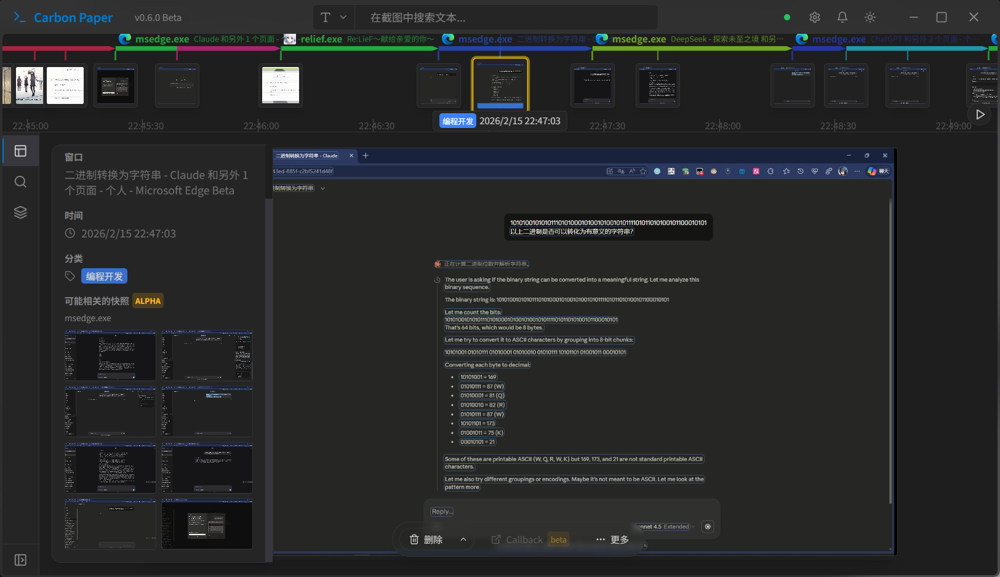

# CarbonPaper

  |
  <a href="./README.md">中文</a> |
  <strong>English</strong> |

## Description

CarbonPaper is an open-source tool that uses OCR and vector storage solutions to help you find anything you saw on your computer screen.

## Download and Install

Prebuilt releases are available on the project's Releases page; the application will automatically download and install required dependencies.

## Why CarbonPaper?

The name "CarbonPaper" refers to carbon copy paper. When you place a thin sheet under a written page and press, the impression transfers to the sheet underneath — creating a copy.

CarbonPaper (this project) provides the following features:

- Record what the user sees on screen.
- Use Windows CNG to securely encrypt and store snapshots using the user's system-provided hardware/software security.
- Unless the user permits otherwise, no data leaves the user's machine.
- Support OCR keyword search for visible text, and natural-language image-feature search for snapshots.
- Quick snapshot preview via a timeline.
- No Copilot+ verification required; inference runs via DirectML and can use CPU, GPU, or NPU.

## Requirements

- OS: Windows 10 1903 Build 18362 (suggested), Windows 10 1809 or later (minimum, DirectML disabled)
- Architecture: x64
- Internet Access: Yes

Graphics Card (suggested, optional):

| Vendor | Earliest supported model | Release date |
| --- | --- | --- |
| 🟢NVIDIA | GeForce GTX 480 | 2010-03-26 |
| 🔴AMD | Radeon HD 7970 | 2011-12-22 |
| 🔵Intel | Intel HD Graphics 4600 | 2013-05-27 |

## API

Future CarbonPaper releases will provide an open API to let users use AI for snapshot CRUD operations.

## Main open-source libraries used

- OCR: RapidOCR (https://github.com/RapidAI/RapidOCR)
- Vector database: ChromaDB (https://github.com/chroma-core/chroma)
- User Interface: Tauri (https://github.com/tauri-apps/tauri)
