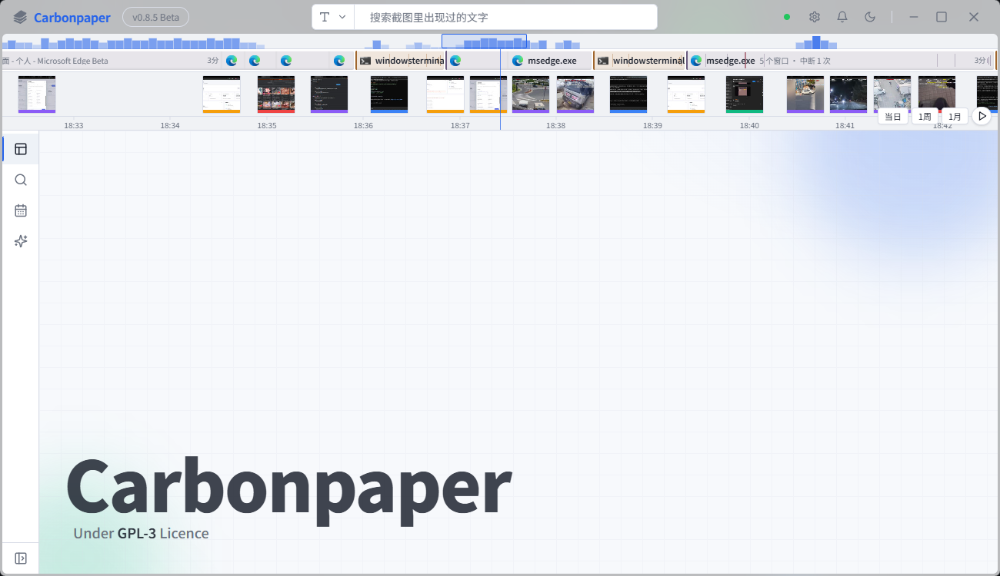

<div align="center">

# CarbonPaper

**Find what you've seen on your screen.**

[](https://github.com/White-NX/carbonPaper/releases/latest)

[](./LICENSE)
[](https://github.com/White-NX/carbonPaper/actions/workflows/release.yml)

[简体中文](./README.md) · **English**

[Download](https://github.com/White-NX/carbonPaper/releases/latest) · [Quick start](#quick-start) · [Development and contributing](#development-and-contributing) · [Report an issue](https://github.com/White-NX/carbonPaper/issues)

</div>

CarbonPaper is an open-source screen history app for **Windows**. It records snapshots according to your settings, helps you find past content through text, visual descriptions, and a timeline, and stores screenshots and recognized text encrypted on your computer.



## Features

- **Text and picture search**: find snapshots using keywords you remember or a description of what was on screen.
- **Timeline browsing**: revisit earlier activity and inspect the captured screen and recognized text.
- **Smart organization**: describe a topic and automatically collect matching snapshots. The required components are prepared when you first enable it.
- **Daily recaps**: connect an AI model service of your choice to summarize activities and progress, with source records you can revisit.
- **Control over recording**: pause at any time, exclude applications or window titles, and clear history for a selected time range.
- **Browser and AI integrations**: preserve webpage sources with the Chrome / Edge extension and give authorized AI assistants access to history through MCP.

## Download and install

Get the latest version from [Releases](https://github.com/White-NX/carbonPaper/releases/latest). Each release includes notes about its features and changes.

| Download | How to use it |
| --- | --- |
| `*-setup.exe` installer | Recommended for everyday use. Run it and follow the installation wizard. |
| `*_x64_portable.zip` portable package | Extract the entire archive into a folder, keep the included files together, and run `carbonpaper.exe`. |

### Running the app

| Item | Details |
| --- | --- |
| Platform | Windows desktop, x64. An up-to-date Windows 11 installation is recommended. |
| Authentication | Windows Hello configured and available, using a PIN, fingerprint, or face recognition. |
| Desktop runtime | [Microsoft Edge WebView2 Runtime](https://developer.microsoft.com/microsoft-edge/webview2/). The installer checks for it and installs it when needed. |
| Inference | Runs on the CPU, with acceleration available on compatible DirectML GPUs. A dedicated NPU is not required. |
| Network | Needed for component downloads, update checks, and cloud AI services. See the [FAQ](#faq) for offline use. |
| Storage | Allow space for application components, snapshots, and indexes. History retention and storage limits can be configured in the app. |

On first launch, CarbonPaper checks the required components and guides you through any downloads. Additional downloads depend on the features you select.

Enabling “Keep organizing after a restart” requests administrator approval to install a local service and restarts CarbonPaper once. Installed and portable packages use the same activation flow.

## Quick start

1. **Complete setup**: launch CarbonPaper, authenticate with Windows Hello when prompted, and choose recommended or custom settings for features, resource use, and startup.
2. **Prepare components**: wait for the core components to be ready. If you enable smart features, the wizard shows the additional download and its progress.
3. **Set your recording scope**: add application and window-title filters in **Settings → Capture**. Use the top bar to start or pause recording. If you selected automatic recording, it starts once the core components are ready.
4. **Find something again**: after recording some activity, open **Advanced Search** and select **Text** for keywords or **Picture** for a visual description. You can also browse snapshots on the timeline in **Preview**.

For example, text search can find a project name you saw, while picture search can look for “a login page with a blue background.” Searches cover the history you have already recorded.

## Privacy and data security

Screenshots and recognized text are encrypted on your computer, with access authenticated through Windows Hello. Session duration and background processing permissions can be adjusted in **Settings → Privacy & Access**.

Data handling depends on the feature:

| Feature | How data is handled |
| --- | --- |
| Recording, OCR, text and picture search, smart organization | Processes history on your computer. |
| Component downloads and application updates | Connects to download sources to retrieve files. |
| AI search and daily recaps | Sends the record content needed for the task to your selected model service, which may run locally or in the cloud. |
| External AI assistants / MCP | Provides records to authenticated clients. Further processing depends on the client's configuration. |

The MCP service listens only on the local machine and uses access tokens for authentication. Data queries also require an unlocked app session. **AI assistant access** provides sensitive-content filtering and personal-information masking settings. Configure these features according to your data-sharing preferences when using cloud models or external assistants.

## Advanced use

### Browser extension

The Chrome and Edge extension saves page addresses, titles, and links with browser records so you can return to the original webpage.

1. Open **Settings → Capture → Browser Extension**, choose your browser, and select **Set up browser**.
2. Enable **Developer mode** in the extension manager that opens, select **Load unpacked**, and choose the extension folder shown by CarbonPaper.
3. Keep CarbonPaper running, confirm that the browser shows **Connected**, and turn on **Enable extension enhancement**.

### AI search and daily recaps

Add a service and test the connection in **Settings → AI → Model services**. You can use a cloud service or connect to Ollama or LM Studio running on your computer.

Then ask a question in the **AI** mode of **Advanced Search** to let the model find records and answer. Daily recaps are enabled separately in **Settings → Organize → Daily recap**, where you can also choose the model used to generate them.

These features use your configured model service. Text search, picture search, and smart organization use local components.

### MCP access

CarbonPaper includes an MCP service for clients that support Streamable HTTP. It provides access to screenshot history, recognized text, smart organization, and daily recaps.

1. Keep CarbonPaper running and unlocked, then enable MCP in **Settings → AI → AI assistant access**.
2. Choose your target Agent and copy the setup prompt provided by the app. Configure the client with the endpoint and access token shown on the page.
3. Run the **MCP Connection Test** to verify service status and authentication.

Store the token in your client's private configuration, keeping it out of chats, logs, and repositories. See the [MCP tool contract](./docs/mcp-tool-contract-v2.json) for tool definitions and [recap query tools](./docs/recap-query-tools.md) for the daily recap interfaces.

## FAQ

<details>
<summary>Can I use CarbonPaper offline?</summary>

Once the required components are ready, recording, OCR, text and picture search, and smart organization can run locally without a network connection. Component downloads, update checks, and cloud model calls need network access. AI search and daily recaps can also connect to a local model service.

</details>

<details>
<summary>Why are no new snapshots appearing?</summary>

Check the recording status in the top bar and the component download progress first. If automatic recording is disabled, start it manually. Resource policies may pause recording on battery power or while games or fullscreen applications are running. Application and window-title filters also affect what is captured. Review these options in **Settings → General** and **Settings → Capture**.

</details>

<details>
<summary>How much storage does it use, and how can I manage history?</summary>

Usage depends on enabled components, screen resolution, recording time, and history retention settings. In **Settings → Storage & Maintenance**, you can inspect actual usage, change the storage location, set retention and storage limits, and clear records for a selected time range. Download prompts show the size of the relevant components.

</details>

<details>
<summary>How do I back up my data or move to another computer?</summary>

Export a password-protected backup from **Settings → Storage & Maintenance**, then restore it using the backup import feature in the destination installation. Exporting requires you to unlock your records; restoring requires the backup password. Keep both the backup and its password safe.

</details>

## Development and contributing

The interface uses React, Vite, and Tailwind CSS. Tauri v2 and Rust handle desktop features and background processing, with SQLite / SQLCipher for local storage.

On Windows, install Node.js **22.18.0 or later**, Rust stable, and the [Tauri Windows prerequisites](https://v2.tauri.app/start/prerequisites/#windows), including Microsoft C++ Build Tools and WebView2. Then run:

```powershell
git clone https://github.com/White-NX/carbonPaper.git
cd carbonPaper
npm install
npm run debug
```

`npm run debug` prepares development resources and starts the full desktop app. It uses the current user's existing data and settings and requests administrator approval when needed. See [debugging with the real Windows service](./docs/app-bound-processing.md#debug-with-the-real-windows-service) for details.

| Command | Purpose |
| --- | --- |
| `npm run dev` | Start the Vite frontend development server on its own. |
| `npm run build` | Run TypeScript checks and build the frontend. |
| `npm run lint:ci` | Check frontend and browser-extension ESLint errors. |
| `npm run test:frontend` | Run frontend tests. |
| `npm run test:backend:fast` | Run security checks and Rust library tests. |
| `npm run i18n:check` | Check translation keys and locale parity. |

Full release packaging uses `npm run tauri:build` and requires release signing configuration. See [build and automated checks](./docs/app-bound-processing.md#build-and-automated-checks) for the requirements.

Bug reports, feature suggestions, translations, and pull requests are welcome. Read the [contribution guidelines](./CONTRIBUTING.md) and, for interface work, the [UI overlay conventions](./docs/ui-overlay-conventions.md). Keep the Chinese and English documentation in sync when changing features or documentation.

- Bugs and feature requests: [GitHub Issues](https://github.com/White-NX/carbonPaper/issues).
- Security vulnerabilities: follow the reporting instructions in the [security policy](./SECURITY.md).

## License and acknowledgments

CarbonPaper is licensed under [GNU GPL v3](./LICENSE). Third-party components and models retain their own licenses.

Built with these open-source projects:

- [Tauri](https://github.com/tauri-apps/tauri) and [React](https://github.com/facebook/react): desktop framework and user interface.
- [RapidOCR](https://github.com/RapidAI/RapidOCR): text recognition.
- [ONNX Runtime](https://github.com/microsoft/onnxruntime) and [DirectML](https://github.com/microsoft/DirectML): local inference.
- [Chinese-CLIP](https://github.com/OFA-Sys/Chinese-CLIP), [Sentence Transformers](https://github.com/UKPLab/sentence-transformers), and [BGE](https://github.com/FlagOpen/FlagEmbedding): visual and text retrieval and semantic matching.
- [SQLite](https://www.sqlite.org/) and [SQLCipher](https://github.com/sqlcipher/sqlcipher): local data storage.

Community:

- [linux.do](https://linux.do)

The name “CarbonPaper” comes from carbon copy paper, which leaves a copy as you write. CarbonPaper brings that idea to your screen history, so you can keep searchable memories of what you have seen.
