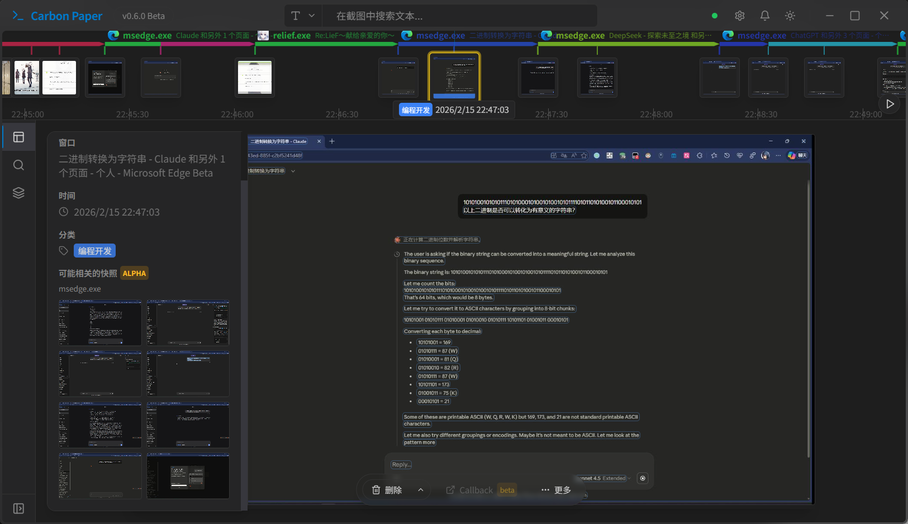
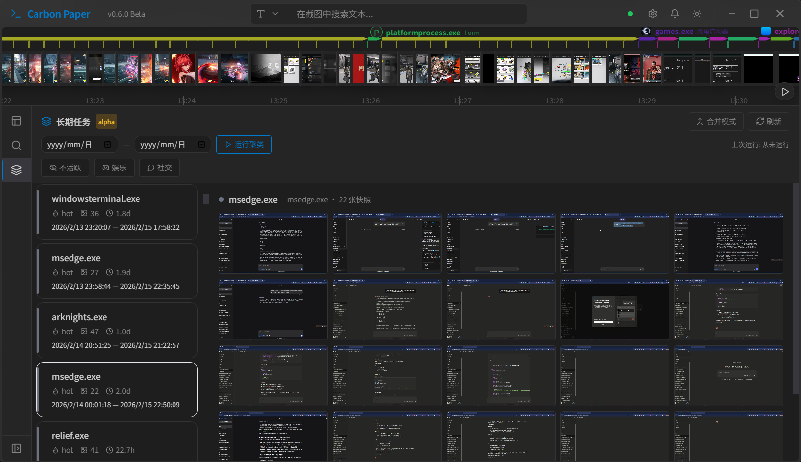

# CarbonPaper - 复写纸

  |
  <a href="./README.en.md">English</a> |
  <strong>中文</strong> |

## Description

CarbonPaper 是一个利用开源OCR和向量存储解决方案的，旨在帮助查找在电脑上看到的任何内容的开源程序。

## Download and Install

可以直接使用 [Releases](https://github.com/White-NX/carbonPaper/releases) 中的预构建版本，程序会自动下载和安装其所需依赖

## Why Carbonpaper?

`CarbonPaper`，中文译名复写纸。复写纸是一种特殊的纸张，它的使用方式是在它下面放置一张另外一张纸（通常薄一些），用力的在上层纸张上写字，颜色将会因压力而转到下层纸上，从而起到复写的作用。

### Features

CarbonPaper（本程序） 具有以下功能：

#### 安全地存储与记录

CarbonPaper 将忠实地记录用户所见，并利用系统的 CNG 服务加密存储用户快照。CarbonPaper 不会向任何第三方上传数据。

#### 快捷检索

CarbonPaper 支持 OCR 关键词搜索所见文本，同时也支持使用自然语言的图片特征搜索快照。同时 CarbonPaper 也会对快照进行分类，以便快速查询。

#### 任务聚类（目前仅限中文环境）

CarbonPaper 会自动尝试识别用户正在或先前执行的任务，并将快照进行关联。

#### 无需 NPU

不需要 Copilot+ 验证，相关服务通过 DirectML 使用 CPU 或 GPU 进行推理。

## Requirements

OS: Windows 10 1903 Build 18362 (suggest), Windows 10 1809 or later (minimum, DirectML disabled)

Architecture: x64

Internet Access: Yes

Graphics Card: (Suggested, *optinal*)
| 制造商 | 最早支持型号 | 发布日期 |
| --- | --- | --- |
| 🟢NVIDIA | GeForce GTX 480  | 2010/3/26 |
| 🔴 AMD  | Radeon HD 7970  | 2011/12/22  |
| 🔵 Intel | Intel HD Graphics 4600 | 2013/5/27 |

Storage: More than 10GB of available space.

## Storage Usage

CarbonPaper needs storage space to store models, dependencies, snapshots and database. 

The model files and dependencies will take up approximately 4GB. With high-frequency use, it is estimated that approximately 2GB of snapshots and database usage will be generated per month.

## API
未来的 CarbonPaper 会提供开放API的功能，以允许用户使用 AI 进行快照的增删改查

## Main open source libs used

- 文本OCR：[RapidOCR](https://github.com/RapidAI/RapidOCR)
- 向量数据库：[ChromaDB](https://github.com/chroma-core/chroma)
- UI：[Tauri](https://github.com/tauri-apps/tauri)
