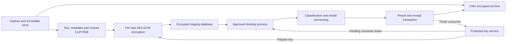

# App-Bound Processing

This feature lets an approved CarbonPaper runtime finish newly captured work
after a restart, before the archive is unlocked. It covers pending classification,
MiniLM and CLIP inputs. Existing screenshots and OCR rows keep their CNG
encryption and authorization rules; keyword HMAC indexing resumes through the
existing unlock path without waiting for an idle window.

Source snapshot: application version `0.8.5`, branch `feat/app-bound-processing`,
implementation commit `2c0329acfa533edec24c6bd0e5cd77eb8dbcf6ef`. This page was
written after that source commit; it does not describe an already published release.

## Components and data flow

| Component | Responsibility | Source |
| --- | --- | --- |
| Desktop process | Capture, staging encryption, model dispatch, scoped result commits | [processing_stage.rs](../src-tauri/src/processing_stage.rs), [capture.rs](../src-tauri/src/capture.rs) |
| `carbonpaper-key-service.exe` | LocalSystem service, caller verification, task keys and grant lifecycle | [service.rs](../src-tauri/app-bound/src/windows/service.rs), [ledger.rs](../src-tauri/app-bound/src/ledger.rs) |
| `carbonpaper-protected-setup.exe` | UAC installation, repair, registration and service removal | [install.rs](../src-tauri/app-bound/src/windows/install.rs) |
| `carbonpaper-python.exe` | Separate, unprivileged Python host; classification orchestration | [python.rs](../src-tauri/src/bin/python.rs), [worker_process.py](../monitor/monitor/worker_process.py) |
| Native model worker | MiniLM, CLIP and BGE inference with the existing scheduler | [semantic_runtime.rs](../src-tauri/src/semantic_runtime.rs), [classification_runtime.rs](../src-tauri/src/classification_runtime.rs) |
| Archive storage | Source revisions, deletion outbox and transactional completion receipts | [storage/processing_stage.rs](../src-tauri/src/storage/processing_stage.rs), [derived_index.rs](../src-tauri/src/storage/derived_index.rs) |



OCR runs at capture time. Staging contains OCR text, title, process, capture
timestamp, image hash, source revision, and the RGB pixels of the 224 × 224 CLIP
resize. The resized pixels are stored without another lossy image encoding.
Full screenshots remain in the existing archive. Staged plaintext and task-key
buffers use `zeroize`; inference processes necessarily receive the particular
plaintext input they are processing.

Classification, MiniLM and CLIP have separate consumer bits and completion
states. Classification orchestration still runs in Python; its BGE embeddings
run in Rust. Idle, power, foreground and background-enable checks continue to
control automatic dispatch. Only staged inputs receive admission without archive
authorization. History reads, search and manual archive operations retain their
existing session checks.

## Trust boundary

The service issues an independent random AES-256-GCM key for each task. The
serialized `TaskBinding` is authenticated as AAD. It binds the task and dataset
IDs, screenshot ID, input version, consumer mask, ciphertext size and original
expiry. The service wraps the key with DPAPI while impersonating the actual
client user, then wraps that blob again as SYSTEM. Impersonation is confined to
synchronous calls and the thread reverts before any `await`.

The service receives no archive master key, CNG private key or HMAC key. It has no
operation for unwrapping a caller-supplied encrypted key blob. `AcquireTask` can
only return a key from an active service-owned ledger row for a pending consumer.

Caller verification uses the named pipe's kernel-reported PID, process creation
time, actual token SID, protected executable location and signed release
manifest. The only permitted client image is
`Runtime/<runtime-id>/carbonpaper.exe`. Files and directories must reject writes
by ordinary users, have trusted ownership, and contain no reparse points in the
validated runtime path. The main executable is held open against writes and
deletion while its verification is cached.

Clients verify the server PID against SCM, its SYSTEM token SID and its protected
service image path before sending a request. The service grants standard users
only process identity queries and `TOKEN_QUERY` for this check; it grants no
process-memory or token-duplication access. The pipe rejects remote clients and
its client ACL excludes `FILE_CREATE_PIPE_INSTANCE`.

There is no Authenticode dependency. The detached Ed25519 signature uses the
existing update public key in [update-public-key.txt](../src-tauri/update-public-key.txt).
It covers the exact manifest bytes prefixed by `CarbonPaper protected runtime v1\n`.
The installer verifies both source hashes and the bytes actually copied. The
privileged helpers link the CRT statically, and packaging checks their normal and
delayed PE imports against system DLLs. Protected desktop startup removes DLL
and WebView overrides, restricts the search path, and prevents native-worker
fallbacks into developer folders or the Python environment.

The Python interpreter and `.venv` dependencies are deliberately outside the
protected runtime. Their modification and a compromised Python process can
expose inputs legitimately delivered to Python. The separate Python executable
cannot acquire service keys as the desktop image. Callback authorization also
compares every field against an immutable receipt kept in the desktop process;
changing a screenshot ID, dataset, revision, consumer or lease cannot authorize a
different archive write.

This feature does not prevent full compromise of an approved process, recover
plaintext or keys already disclosed to a process, or protect against an
administrator restoring or changing protected files. Service retirement prevents
key reissuance through this protocol; it is not a physical-media erasure claim.
Derived vectors and categories continue to use the existing storage policies.

## Persistence and lifecycle

The installer obtains roots through Windows Known Folder APIs. The conventional
paths below illustrate the resulting layout, rather than environment-variable
overrides accepted by the service.

| Location | Contents and authority |
| --- | --- |
| `%ProgramFiles%/CarbonPaper/Protected/Runtime/<version>-<manifest-hash-prefix>/` | Signed application binaries and bundled resources; the manifest hash prefix is 16 hexadecimal characters |
| `%ProgramFiles%/CarbonPaper/Protected/System/` | Service executable, setup helper, setup lock and machine-wide runtime registration |
| `%ProgramFiles%/CarbonPaper/Protected/Activations/<SID>.json` | Per-user approved runtime selection |
| `%ProgramData%/CarbonPaperKeyService/State/keys.db` | Protected `owners`, `tasks`, `leases` and schema metadata; authoritative grant state |
| `<data_dir>/processing-staging.db` | User-writable encrypted `staged_inputs` and scheduling state in `staged_work` |
| Existing archive database | `app_bound_dataset_id`, `screenshot_processing_revisions`, `app_bound_receipts` and `app_bound_revocations` |

The protocol and limits are defined in [protocol.rs](../src-tauri/app-bound/src/protocol.rs).
Frames contain at most 64 KiB, and an input contains at most 8 MiB of serialized
plaintext plus the 28-byte GCM nonce/tag overhead. Each pipe connection carries
a fresh service nonce and one request with sequence `1`; after reading the reply,
the client sends a one-byte acknowledgement before the server closes the pipe.

1. `PrepareTask` records the scope and wrapped key in the protected ledger. A
   prepare expires after ten minutes if it is not activated.
2. The desktop encrypts and durably stores its input, then sends `ActivateTask`
   with the ciphertext digest. Activation can be retried after an interrupted reply.
3. Before claiming a key, the desktop drains deletion intent and checks the
   dataset, screenshot and local ciphertext. `AcquireTask` creates a five-minute
   consumer lease bound to the calling process identity. Active desktop work can
   renew the lease; local receipt acceptance is limited to fifteen minutes per attempt.
4. A result commit checks the issued receipt, archive generation and source
   revision. The category or vector and its durable receipt are committed in the
   same archive transaction. Duplicate classification callbacks do not rewrite
   an already committed result.
5. `FinishConsumer` consumes that consumer's grant. The key blob becomes `NULL`
   when all consumers finish or are abandoned. Completion acknowledgement can be
   recovered after a crash without applying the result again. A completed
   consumer never causes another pending consumer to be revoked.

Deleting a screenshot records an archive outbox entry. `RevokeScreenshots` locates
the matching tasks by dataset and screenshot in the protected ledger, including
tasks whose local queue rows have disappeared. Failed revocation remains pending
and blocks new key claims until it succeeds. Restoring an old user queue cannot
undo an acknowledged revocation or completion.

Default and maximum retention are 30 days and 4 GiB. Advanced settings can lower
them to one day and 256 MiB. Capacity measures staged ciphertext, not total
SQLite pages, runtime binaries or archive size. Both the service and local
staging enforce capacity. Expiry, smaller limits and disabling retire grants;
raising a limit never extends an existing grant. Protected clock advancement
prevents a backward wall-clock change from reviving an expired task. Temporary
input expiry leaves the encrypted archive available for later authorized work.

Maintenance retries interrupted prepares, completions and deletions, renews live
leases, and scans successive batches rather than repeatedly scanning only the
first tasks. Inputs with malformed binding JSON or invalid ciphertext are retired
without blocking later valid inputs. Acknowledged receipt and retired-task metadata have separate cleanup
windows; the key is removed as soon as the service retires its grant.

Backup payloads exclude the staging database and service state. Import retires
the service's current dataset even when the local stage is unavailable, creates
a fresh dataset ID, and clears restored receipt/outbox state. A same-machine
directory move retains the dataset and staging files. Switching to another data
directory retires the previous dataset first. See
[migration.rs](../src-tauri/src/commands/migration.rs) and
[data_dir.rs](../src-tauri/src/storage/migration/data_dir.rs).

## Activation, update and recovery

Installed and portable packages use the same fixed protected copy. After
activation, the original package delegates startup to that copy. Existing
autostart and Chrome/Edge native messaging registrations are refreshed to point
to the approved runtime. Python installation and user data stay at their existing
locations.

An eligible unlocked UI offers activation once, with a Later action. Activation,
repair and removal invoke the elevated setup helper; UAC cancellation preserves
the existing configuration. Subsequent protected updates also use that helper
before stopping the current monitor. Updates preserve the processing preference,
reject per-user downgrades and avoid downgrading a newer machine-wide service
used by another account. Failed installation restores registration and service
files where possible, never a snapshot of the key/task database.

When service access is unavailable, newly captured material still follows the
archive path and deferred history work waits for normal authorization. Immediate
protected-startup failures leave the original package's repair UI usable. A fresh
signed package can also be launched with `--repair-protected-runtime` to reach
that UI directly. Repair validates and restores missing or corrupted protected
files from that package; files mapped by a running process can require closing
that process and retrying. Use the current or a newer release for repair.

Removal revokes the requesting user's tasks and unregisters that owner. The
machine-wide service is removed when no owners remain. Protected runtime copies
are retained because running applications, shortcuts and other users can still
refer to them; automatic removal of old runtime directories is not implemented.
User archive paths are never removed by the service installer.

The UI boundary is implemented in [app_bound_api.js](../src/lib/app_bound_api.js)
and [app_bound.rs](../src-tauri/src/app_bound.rs):

| Tauri command | Authorization and effect |
| --- | --- |
| `app_bound_status` | Main window; status and offer eligibility |
| `app_bound_acknowledge_offer` | Main window; persist Later/dismissal |
| `app_bound_set_policy` | Main window and session; enable/disable and limits; enabling also requires the background master switch |
| `app_bound_install` | Main window and session; validate signed package, request UAC, activate or repair, restart unelevated |
| `app_bound_uninstall` | Main window and session; request UAC, revoke/unregister, discard local staged inputs |

None of these commands returns task keys or staged plaintext. Python completion
and deferral use `complete_staged_postprocess` and `defer_staged_postprocess`
through the existing authenticated pipe and sequence checks. The service's
public request enum is the protocol reference; it exposes no arbitrary path,
caller SID, private-key or unwrap request.

## Fast Windows preflight

Run this before spending time on a production build:

```powershell
npm run test:app-bound:fast
```

This compiles only the small `src-tauri/app-bound` crate in its test profile. It
does not build Tauri, prepare models, install Python, build native workers or
package the application, and it does not need the release signing key or frontend
dependencies. Cargo reuses the native crate's normal dependency cache; the first
run on a new machine takes longer than an incremental check.

The command runs these checks and stops with a nonzero exit code on any failure:

| Check | What it exercises |
| --- | --- |
| Native pipe regressions | Delayed/fragmented replies, deadlines, EOF and frame bounds using real Windows byte pipes |
| Client/server round trips | The production client exchange and async service handler, including challenge, request, reply and ACK |
| Native DPAPI and durable tasks | Pipe impersonation, real Windows protection calls, ledger reopen, all three consumers and revocation |
| Authority rejection | An unapproved process and a mismatched pipe-token SID are rejected |
| Existing-service repair | Real SCM creation/configuration/repair of a uniquely named temporary service |
| Packaging and guards | Synthetic signed packages, integrity/import rejection and existing security guards |

Windows requests administrator access once for the temporary-service check if
the terminal is not elevated. That fixture never starts its service and removes
it afterward. Cancellation, missing privileges and a selector that runs zero
tests are failures; the command does not report a partial check as successful.
Reports and service-test output are kept under
`src-tauri/app-bound/target/native-checks/<run>/`.

`npm run tauri:build` runs this preflight before asset preparation or release
compilation. Pull requests and pushes to `main` also run it in a separate Windows
CI job, and release CI runs it before its expensive build steps.

The native round-trip fixtures use temporary storage and an explicitly approved
test process in their own caller cache. The production entry point still verifies
the SYSTEM peer; the alternate pipe entry point exists only under `cfg(test)`.
Both DPAPI layers run under the test user's account here. Release acceptance
additionally verifies the real LocalSystem boundary, signed installation and
activation, protected-directory ACLs, UAC/restart handoff, actual worker loading,
cross-user behavior and machine reboot recovery. Passing the preflight provides
the coverage above, rather than certifying those remaining release properties.

## Debug with the real Windows service

```powershell
npm run debug
```

This starts the normal Tauri development window with Vite hot reload and a real
LocalSystem app-bound service. It builds the two small native helpers in debug
mode; no production package or release signing key is required. The desktop and
model workers use the ordinary development build and asset preparation paths.
Incremental builds reuse Cargo's caches.

The development window reuses the existing `CarbonPaperMasterKeyV3` CNG key. If
CarbonPaper has already been set up for this Windows user, unlock with the
existing password. A new CNG key is created only when none exists. Authentication
failures and cancellation never trigger key replacement, and decryption never
creates a missing key.

The application uses the existing data-directory setting from
`HKCU/Software/CarbonPaper`, the existing archive and credential files, and the
normal Tauri application identifier. Settings, autostart, browser integration and
data-directory migration follow the same configuration paths as the installed
application. There is no separate development database or registry profile.

The native service has a stable registration ID for each workspace and Windows
user. Its component cache and protected task ledger use these locations:

| Item | Development service location or name |
| --- | --- |
| Component cache and signing material | `%LOCALAPPDATA%/CarbonPaperDev-<instance>/` |
| Windows service | `CarbonPaperKeyServiceDev-<instance>` |
| Named pipe | `\\.\pipe\CarbonPaper.AppBound.Dev.<instance>.v1` |
| Protected components | `%ProgramFiles%/CarbonPaperDev-<instance>/Protected/` |
| Task ledger | `%ProgramData%/CarbonPaperKeyServiceDev-<instance>/State/` |

The development and release services have separate signing identities and task
grants. This allows the service to authorize the current workspace executable
while the production service retains its signed-release requirements. Archive
reads use the shared CNG credentials and the application's existing session checks.

First startup requests UAC to register the helpers and the exact desktop executable
path and hash. Rust changes restart the desktop through Tauri, refresh changed
helpers and request UAC when registration needs updating. Frontend hot reload
does not need re-registration. Enabling and repairing the component use the
normal settings actions; repair keeps the development window running. The
service remains installed between sessions and can be removed from development
settings.

The registration manifest uses a local development signing key, a separate
signature context and a public key fixed at compile time. This signing key is
unrelated to the CNG archive key and requires no password setup. The service
verifies the actual caller's SID, executable path and registered hash. Its
executable lock lasts for each request so Cargo can replace the desktop after
it exits. The development feature fails compilation when debug assertions are
disabled; production builds accept only their existing protected release identity.

For a small end-to-end check without starting Tauri or loading models, run from
an ordinary, unelevated Windows terminal:

```powershell
npm run test:app-bound:dev
```

This uses a separate probe instance and synthetic input. It requests UAC for
installation, repair and removal, verifies the LocalSystem peer, exercises the
real pipe and user/SYSTEM DPAPI wrapping, recovers a task after service restart,
and completes all three consumers. It also checks that the ordinary client cannot
read the SYSTEM ledger and that a copied executable at an unregistered path is
rejected. It removes the probe service afterward and does not use the archive's
CNG key. UAC cancellation is a failed check.

`npm run test:app-bound:dev:core` runs the native unit tests with the development
feature enabled. `npm run test:app-bound:fast` continues to test the production
protocol and helper configuration before expensive release builds.

## Validation and debugging

`npm run debug` automatically configures the development service and enables the
internal Cargo feature needed for real app-bound connections. The in-process
broker fixtures provide fast protocol, ledger, staging and recovery tests.

Run the automated layer first:

```powershell
npm run test:app-bound
cargo test --manifest-path src-tauri/Cargo.toml --lib
npm run test:security
cargo check --manifest-path src-tauri/Cargo.toml
```

These unit checks cover state-machine and packaging behavior. The development
probe above additionally exercises LocalSystem identity, installation, protected
ledger access, UAC, two-context DPAPI and service restart. Production packaging,
full worker loading, machine reboot recovery and cross-user acceptance still
require a signed release on a disposable Windows installation.

Transport regressions use unique local Windows byte pipes to exercise delayed and
fragmented replies, empty-pipe deadlines, disconnections and frame size limits.
The client reads through Win32 directly: Rust's `File::read` converts
`ERROR_NO_DATA` on a `PIPE_NOWAIT` handle into a zero-byte read, which would
otherwise make a healthy connection look closed before its reply arrives.

The service repair regression is ignored by ordinary `cargo test` because it
requires administrator access. The fast preflight above runs it explicitly. It
can also be run directly from an elevated Windows test terminal:

```powershell
cargo test --manifest-path src-tauri/app-bound/Cargo.toml --lib windows::install::tests::existing_service_repair_reapplies_restart_policy -- --ignored --exact
```

It creates and removes a uniquely named test service with a nonexistent executable,
without starting it or accessing CarbonPaper's installed service or user data. It
checks that creation and repair both restore the restart policy, including the
`SERVICE_START` access required to configure `SC_ACTION_RESTART` on an existing
service handle.

The protected runtime now has two complementary logs:

| Process | Location | Contents |
| --- | --- | --- |
| Desktop application | The active data directory under `logs/<date>/carbonpaper.log` | Client-side broker operation, consumer and redacted error code |
| Key service | `%ProgramData%/CarbonPaperKeyService/State/logs/service.log` | Service lifecycle, fixed request operation, request stage and redacted error code |

The service log is best-effort and rotates at 4 MiB to `service.log.1`. A logging
failure never changes broker behavior. It deliberately excludes keys, wrapped-key
blobs, OCR text, images, complete SIDs, task/dataset/lease identifiers, paths and
request JSON. Fixed event and stage names are suitable for diagnosis; the log is
not an audit ledger.

For a minimal end-to-end pass in a disposable virtual machine:

1. Install or activate a signed package and enable protected background processing.
2. Confirm the service is running with `sc.exe queryex CarbonPaperKeyService`.
3. Capture a uniquely recognizable test record and close CarbonPaper before all
   classification, MiniLM and CLIP consumers finish.
4. Reboot, leave the archive locked and allow the machine to become idle.
5. Inspect the desktop and service logs. A normal task progresses through the fixed
   operations `prepare_task`, `activate_task`, `acquire_task` and
   `finish_consumer`; desktop completion and archive receipt handling occur between
   acquire and finish.
6. Unlock the archive and confirm derived results and keyword search catch up
   without duplicate result application.

A service entry such as
`event=connection_failed stage=verify_caller error=app_bound_access_denied`
locates an identity-boundary rejection. `stage=read_request`,
`stage=validate_request`, a fixed operation name, `stage=write_response` and
`stage=read_ack` distinguish transport, protocol, authority and reply failures.
Use the broader acceptance list below for cancellation, tampering, cross-user,
rollback, deletion and migration cases. Do not treat a development build with a
locally copied service executable as equivalent to this signed acceptance pass.

## Build and automated checks

```powershell
npm run build:protected:release
npm run test:app-bound
cargo test --manifest-path src-tauri/Cargo.toml --lib
npm run test:frontend
npm run build
npm run test:security
& "$env:LOCALAPPDATA\carbonpaper\.venv\Scripts\python.exe" -m pytest monitor/tests -q --timeout=15
```

The existing spaCy integration fixture can exceed the fifteen-second test limit
during a cold model load. The full Python suite was also checked with
`--timeout=60`; this changes the test invocation, not the production timeout.

Debug builds do not contact the production broker. The normal debug command
uses the development service and build-time trust identity; unit tests inject an
in-process broker with temporary storage. Neither adds a developer-path or
environment-key override to production authorization. Signature tests generate
ephemeral keys inside their fixtures and do not replace the release public key.

The release pipeline builds both helpers and the separate Python launcher before
Tauri bundling. `beforeBundleCommand` signs the final binary/resource manifest;
the portable packer signs its final files as well. Signing requires the existing
base64 PEM `CARBONPAPER_UPDATE_SIGNING_KEY` and checks that its public key matches
the application. Missing or mismatched keys fail packaging.

[verify-release-bundles.ps1](../scripts/verify-release-bundles.ps1) verifies both
extracted portable and NSIS contents, including signature, file hashes and
privileged-helper imports. It does not run either privileged helper.

The focused tests cover binding, SID/runtime isolation, expiry, capacity,
consumer completion, failed protection, registration rollback, callback tampering,
transactional category/vector writes, restart recovery, deletion with lost queue
rows, and UI activation/repair/cancellation/limits. Sources:
[broker tests](../src-tauri/app-bound/src/ledger.rs),
[staging tests](../src-tauri/src/storage/processing_stage/tests.rs),
[package tests](../scripts/protected-runtime.test.mjs),
[Python callbacks](../monitor/tests/test_ocr_postprocess_queue.py), and
[settings tests](../src/components/settings/advanced/ProtectedProcessingCard.test.jsx).

## Isolated Windows acceptance

These checks require a disposable Windows machine with a real signed release,
Windows Hello credentials, and administrator access for UAC. Unit tests and
successful compilation do not substitute for this acceptance pass. Do not run
service installation or protected-directory mutation tests on a daily-use data
installation.

1. Activate from both installed and movable portable packages. Verify the
   original package delegates, autostart/native messaging paths remain usable,
   and the desktop and Python processes keep distinct executable identities.
2. Cancel activation, repair, removal and an update at UAC. Confirm the current
   app/monitor keeps running and the existing policy remains unchanged.
3. Capture identifiable test inputs, exit before all consumers finish, reboot,
   and leave the archive locked. During idle time confirm the remaining staged
   consumers finish while archive search/read authorization stays locked. Unlock
   and confirm keyword search catches up without requiring another idle period.
4. Run two standard-user accounts. Confirm cross-SID requests fail and activating
   an older allowed package for one account does not replace a newer global
   service. Confirm the standard-user client can query the service identity but
   cannot read process memory or duplicate its token.
5. Attempt requests from Python, a copied desktop executable in a writable
   folder, an obsolete protected runtime, and a forged local pipe server.
   Confirm no task keys are delivered. Test remote pipe access rejection.
6. Interrupt prepare/activate, inference, result commit and completion replies.
   Restart app and service independently. Confirm one consumer's failure or
   completion leaves the other pending consumers available, and committed
   results are not applied twice.
7. Save user-queue snapshots, then complete, delete, expire, disable or exceed
   capacity for those tasks. Restore the snapshots and verify key requests remain
   denied. Repeat deletion after removing the queue's task row. Repeat expiry
   after moving the wall clock backwards.
8. Exercise backup import, same-machine directory move and switch-only migration,
   including an unavailable/corrupt staging database. Verify import/switch
   retirement cannot be bypassed and old callbacks cannot write into a new
   archive generation.
9. Corrupt a package file/signature and attempt installation. Corrupt a protected
   resource in the disposable environment and repair from a fresh signed package.
   Exercise missing service, missing registration, service-start failure and an
   interrupted update. Confirm recovery never restores an old task-key database.
10. Remove one user's component while another remains, then remove the last
    owner. Verify that grants are revoked, shared-service lifetime follows owner
    registration, and archive data is preserved.

Record Windows build, release/runtime ID, user type, steps and observed result
for each case. Production signing and SYSTEM/UAC/reboot acceptance remain release
validation work when the signing key or isolated Windows machine is unavailable.
